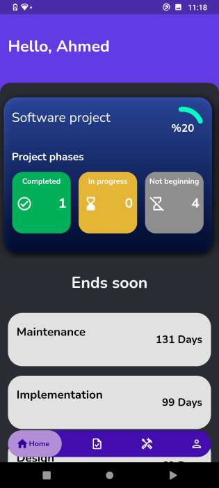
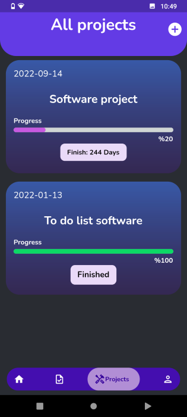
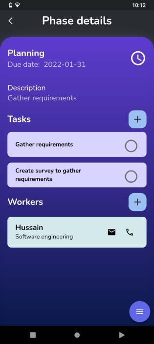
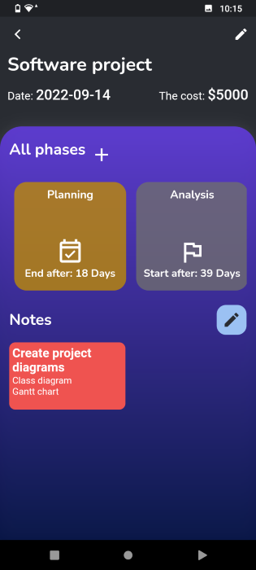
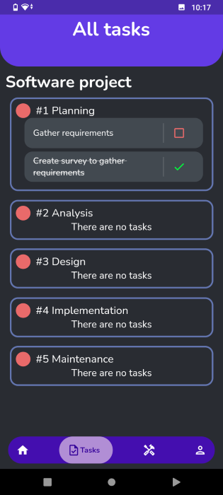
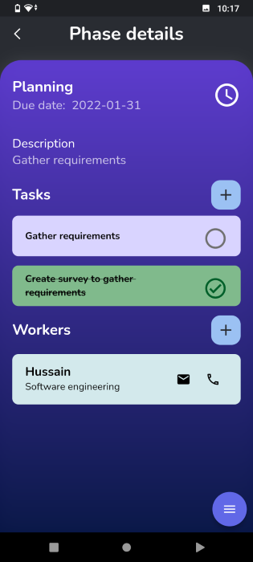

# Pro Manage
Using this application you can manage and track your projects easier. All information stored in Firebase backend

## Technologies used

## The application available at
[Google Play](https://play.google.com/store/apps/details?id=com.pro.management)

## Screenshots

